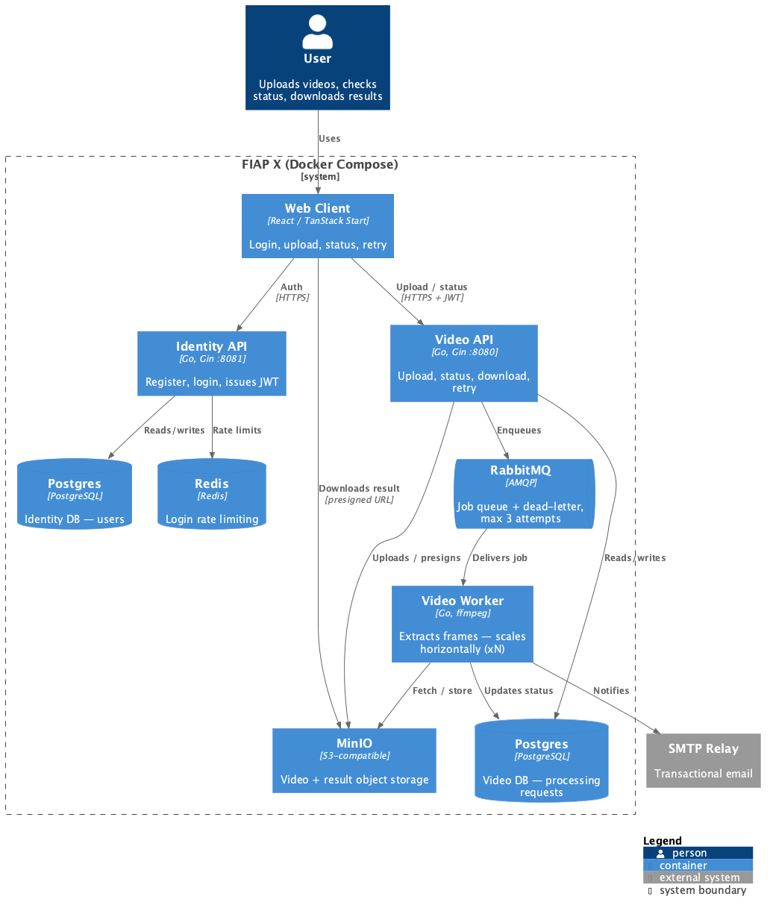
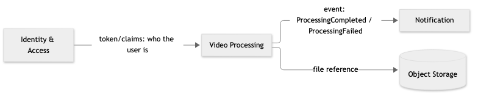
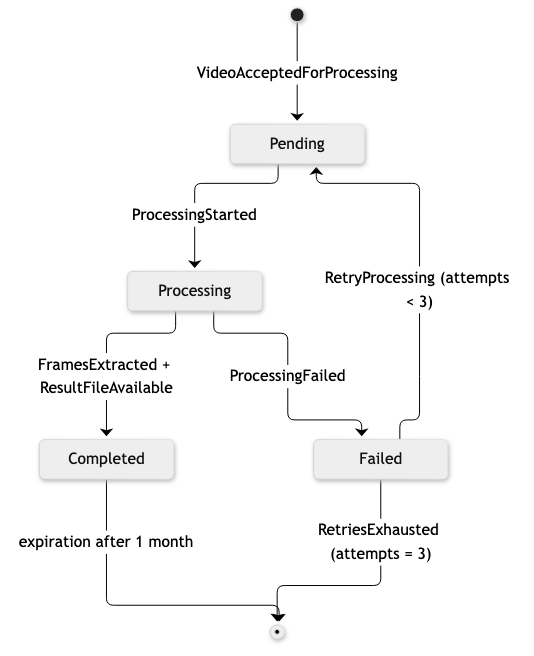

# fiapx-video-processor

Backend for the FIAP X Video Processing System (POSTECH/SOAT Hackathon — Phase 5): accepts a video, asynchronously extracts its frames, and delivers the result as a downloadable `.zip`, with authentication, status listing, and email notification.

Hexagonal architecture in Go, split into three independently deployable services, one per bounded context with a runtime footprint (see [`docs/adr/0007`](docs/adr/0007-split-into-independently-deployable-services-by-bounded-context.md)):

- **`identity-api`** (port `8081`) — HTTP (Gin): registration, login, JWT issuance. Owns its own database. Login is rate-limited (5 attempts/minute per IP, Redis-backed — see [`docs/adr/0010`](docs/adr/0010-redis-backed-login-rate-limiting.md)).
- **`video-api`** (port `8080`) — HTTP (Gin): upload, status listing, download, retry. Verifies JWTs locally against a secret shared with `identity-api`. Owns its own database.
- **`video-worker`** — RabbitMQ consumer: extracts frames with `ffmpeg`, builds the `.zip`, updates status, sends the outcome notification.

Notification is an in-process library used by `video-worker`, not a separate service (see [`docs/adr/0006`](docs/adr/0006-notification-sent-synchronously-best-effort.md)). There is no API gateway yet — the frontend talks to `identity-api` and `video-api` directly on their own ports.

The frontend (TanStack Start + React) lives in a separate repository: [`fiapx-web`](../fiapx-web).



## Running locally

Requirements: Docker + Docker Compose.

```bash
cp .env.example .env
docker compose up --build
```

This starts two Postgres instances (one per service), Redis, RabbitMQ, MinIO, and boots `identity-api`, `video-api`, and `video-worker` — each of which applies its own database migrations and (for the two Video Processing services) ensures its MinIO buckets exist on startup, no separate init container involved (`docs/adr/0009`).

To demonstrate concurrent processing of multiple videos (see [`docs/technical-architecture.md`](docs/technical-architecture.md) §4), scale the worker:

```bash
docker compose up --build --scale video-worker=3
```

Check that each API is healthy (its own Postgres connectivity included):

```bash
curl http://localhost:8081/health   # identity-api
curl http://localhost:8080/health   # video-api
```

Metrics and dashboard (see [`docs/adr/0008`](docs/adr/0008-minimal-observability-with-prometheus-and-grafana.md)):

- Prometheus: [http://localhost:9090](http://localhost:9090) (targets: `identity-api`, `video-api`, `video-worker`, `rabbitmq`)
- Grafana: [http://localhost:3000](http://localhost:3000) (anonymous viewer access, dashboard "FIAP X - Video Processing Overview" pre-provisioned)

## Load test

```bash
docker compose up --build --scale video-worker=3
brew install k6   # or see https://k6.io/docs/get-started/installation/
k6 run scripts/loadtest/upload_stress.js
```

Fires 20 (configurable via `--env VUS=N`) concurrent real video uploads at `video-api` and asserts every single one is accepted and reaches `COMPLETED` — evidence for "process more than one video at a time" and "don't lose a request under a spike" (`docs/adr/0012`). Watch it land and drain live on Grafana ([http://localhost:3000](http://localhost:3000)) while it runs.

## Tests

```bash
go test ./...                        # unit tests (domain + application, via fakes)
go test -tags=integration ./...      # + real integration tests against Postgres (needs DATABASE_URL)
```

The same pipeline runs in CI (`.github/workflows/ci.yml`): unit tests → integration tests (Postgres service container) → Docker image builds.

## Documentation

**Bounded contexts (strategic DDD)** — Identity is a generic subdomain, Video Processing is the core domain, Notification is supporting; contexts talk only through a token and a domain event, never a direct call:



**`ProcessingRequest` lifecycle** — the aggregate's state machine, including the retry policy that keeps a request from being lost under a spike:



| Topic | Document |
|---|---|
| Technical architecture, stack, and how each challenge requirement is met | [`docs/technical-architecture.md`](docs/technical-architecture.md) |
| C4 container diagram | [`docs/architecture/C4/c4-container-diagram.png`](docs/architecture/C4/c4-container-diagram.png) (source: [`.puml`](docs/architecture/C4/c4-container-diagram.puml)) |
| Runtime architecture diagram (interactive, older/less accurate than the C4 diagram above) | [`docs/architecture/fiapx-runtime-architecture.html`](docs/architecture/fiapx-runtime-architecture.html) |
| Bounded contexts and context map (strategic DDD) | [`docs/bounded-contexts.md`](docs/bounded-contexts.md) |
| Domain modeling and business rules | [`docs/domain-modeling.md`](docs/domain-modeling.md) |
| Event storming | [`docs/event-storming.md`](docs/event-storming.md) |
| Core domain (aggregates, invariants) | [`docs/core-domain.md`](docs/core-domain.md) |
| Use cases | [`docs/use-cases.md`](docs/use-cases.md) |
| API contract (routes, request/response, status codes) | [`docs/api-contract.md`](docs/api-contract.md) |
| Login rate limiting (Redis-backed) | [`docs/adr/0010`](docs/adr/0010-redis-backed-login-rate-limiting.md) |
| Recorded architectural decisions (ADR) | [`docs/adr/`](docs/adr/) |
| Database schema / creation script | [`migrations/`](migrations/) |

## Challenge deliverables

- **Architecture documentation**: above.
- **Database creation script**: [`migrations/`](migrations/) (golang-migrate, embedded in and applied automatically by each service on startup — `docs/adr/0009`).
- **Code**: this repository.
