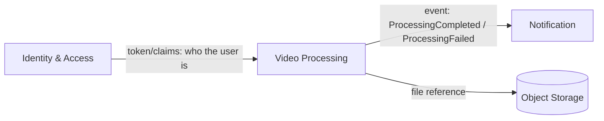

# Bounded Contexts — FIAP X (Video Processing System)

> Strategic domain design: identification of subdomains, their strategic role, ubiquitous language, and how they relate to each other. Complements `docs/domain-modeling.md` (sections 4 and 6).

## Overview and strategic classification

| Context | Strategic role | Why |
|---|---|---|
| **Video Processing** | **Core domain** | This is what FIAP X sells — the competitive differentiator. Where more care should go into modeling, testing, and resilience. |
| **Identity & Access** | **Generic subdomain** | A problem already solved by the industry (login/password/token). Not where the business value lies — can (and should) be implemented simply. |
| **Notification** | **Supporting subdomain** | Necessary for the product experience, but not the competitive differentiator. |

## Context map

- **Identity → Video Processing**: a **Conformist** relationship. The core domain doesn't know — nor should it know — the internal details of how the user authenticates. It only receives a trusted identifier via token claims (e.g., `sub`, `user_id`). This is a minimal, stable contract that isolates the core domain from any future change in how authentication works (switching from a homegrown JWT to Keycloak, for example, shouldn't impact Video Processing).
- **Video Processing → Notification**: integration via **Domain Events / Published Language**, not a direct call (it's not a `NotificationClient.sendEmail()` called from inside the core). The core domain only announces facts (`ProcessingCompleted`, `ProcessingFailed`); how that is communicated to the user is the exclusive responsibility of the Notification context.
- **Video Processing → Object Storage**: not a business bounded context, it's an infrastructure dependency (generic technical capability), treated as a technical "Generic Subdomain," with no business rules of its own.

## Context: Identity & Access

**Responsibility**: register users, authenticate (login), issue and validate session tokens.

**Ubiquitous language**:

| Term | Definition |
|---|---|
| User | A person who uses the system to process videos |
| Credential | Email + password (hash) pair used for authentication |
| Session / Token | Proof of authentication with a limited lifetime |

**Published events**: `UserRegistered`, `UserAuthenticated`.

**What this context does NOT do** (anti-scope, to keep the boundary clear):
- Doesn't know anything about videos, processing requests, or status.
- Doesn't decide business roles/permissions (there is no admin in this version — see `docs/domain-modeling.md` 7.1).
- Isn't responsible for notifying the user about processing events.

## Context: Video Processing (Core Domain)

**Responsibility**: receive, validate, orchestrate, and track the lifecycle of a video processing request, from submission to result availability.

**Ubiquitous language**:

| Term | Definition |
|---|---|
| Processing Request | The aggregate root — a user's request to process a specific video |
| Video | The original file submitted by the user |
| Frame | An image extracted from a moment in the video |
| Result Package | The `.zip` file containing the extracted frames |
| Status | The request's current state: `Pending`, `Processing`, `Completed`, `Failed` |
| Attempt | Each run (initial or reprocessing) of the same request |
| Failure Reason | Structured code for the cause of a `Failed` state (see `docs/domain-modeling.md` 7.5) |

**Published events**: `VideoSubmitted`, `VideoRejected`, `VideoAcceptedForProcessing`, `ProcessingStarted`, `FramesExtracted`, `ProcessingFailed`, `ResultFileAvailable`, `ReprocessingRequested`, `RetriesExhausted`.

**Consumed events**: no domain events from other contexts — only the authentication contract (token claims) from Identity.

**What this context does NOT do** (anti-scope):
- Doesn't know how the email/notification is sent, nor the message template.
- Doesn't know how the user's password is validated.
- Doesn't decide retention policy independently per case — the 1-month/3-attempt rule is global and simple (see `docs/domain-modeling.md` 7.3, 7.4), not configurable per video.

See `docs/core-domain.md` for the detailed model of this context's aggregate.

## Context: Notification

**Responsibility**: react to core domain events and communicate the outcome to the user through the appropriate channel (email, and optionally an in-app indicator).

**Ubiquitous language**:

| Term | Definition |
|---|---|
| Notification | A communication sent to the user about the outcome of a request |
| Channel | The delivery medium (email, in-app) |
| Template | The format/content of the message, varying by reason (success, each error code) |

**Consumed events**: `ResultFileAvailable`, `ProcessingFailed`, `RetriesExhausted`.

**Published events**: `UserNotified` (internal fact, useful for audit/observability — doesn't need to be consumed by anyone).

**What this context does NOT do** (anti-scope):
- Doesn't decide *whether* something succeeded or failed — it only reacts to what the core domain has already decided.
- A notification delivery failure (e.g., email provider unavailable) must not impact the Processing Request's state — this is a hotspot already logged in `docs/event-storming.md`.

## Why 3 contexts, no more, no less

- **We did not separate "Upload" from "Status Query"** as distinct contexts, because both operate on the same aggregate (`ProcessingRequest`) and the same language — they're operations of the same core domain, not different domains. (Technically, this can be a single service/API within the Video Processing context — see the MVP's simplified scope decision.)
- **We did not create an "Admin/Operations" context**, because there's no such actor in the requirements (see `docs/domain-modeling.md` 7.1).
- **Object Storage is not a business bounded context** — it's a generic technical capability used by the core domain, with no language or business rules of its own.
