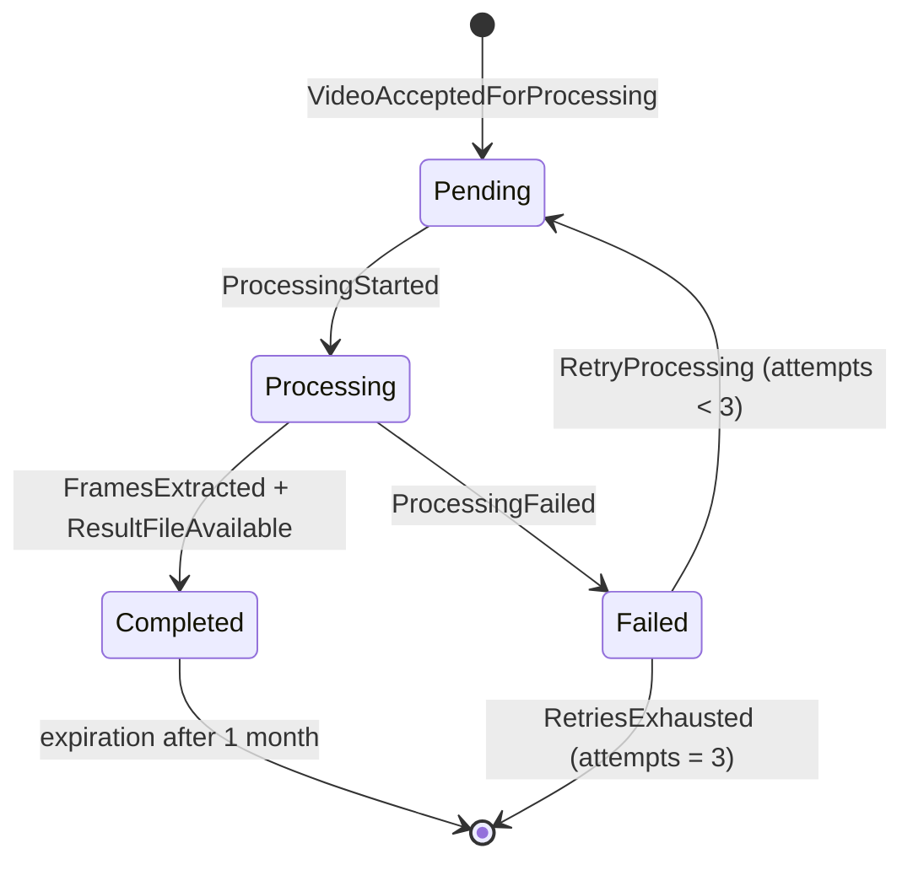

# Core Domain Model — Video Processing

> Detailed model of the core domain's aggregate root (see `docs/bounded-contexts.md`). Complements `docs/domain-modeling.md` (section 5) and reflects the business decisions in `docs/domain-modeling.md` (section 7).

## Aggregate root: `ProcessingRequest`

Represents a user's request to process a specific video, from submission to result availability (or definitive failure).

### Attributes

| Attribute | Type | Description |
|---|---|---|
| `id` | unique identifier | The aggregate's key; used as the idempotency key |
| `userId` | identifier | Owner of the request (opaque reference to the Identity context, not a full object) |
| `videoMetadata` | `VideoMetadata` (value object) | Original name, size, format of the submitted video |
| `status` | enum | `Pending` \| `Processing` \| `Completed` \| `Failed` |
| `failureReason` | optional enum | Filled only when `status = Failed`. See "Failure Reason" section below |
| `attempts` | integer | Run counter (starts at 1, incremented on every `RetryProcessing`) |
| `result` | `ProcessingResult` (value object), optional | Filled only when `status = Completed` |
| `createdAt` | timestamp | Moment of `VideoAcceptedForProcessing` |
| `updatedAt` | timestamp | Last state transition |

### Value objects

**`VideoMetadata`**
- `originalName`: name of the file submitted by the user.
- `sizeBytes`: used to validate the 500 MB limit.
- `format`: normalized extension (`.mp4`, `.mov`, `.mkv`, `.webm`), used to validate supported format.
- `durationSeconds`: used to validate the 30-minute limit (obtained after inspecting the file, before accepting the processing request).

**`ProcessingResult`**
- `frameCount`: total number of extracted images.
- `packageReference`: key/location of the `.zip` file in object storage (not a direct public URL — the download URL is generated on demand via a presigned URL).

### Failure Reason (structured enum)

As decided in `docs/domain-modeling.md` (7.5):

- `INVALID_FORMAT`
- `SIZE_EXCEEDED`
- `CORRUPTED_FILE`
- `INTERNAL_ERROR`

## State machine

Note that rejection at entry (`VideoRejected` — invalid format or size/duration) happens **before** the aggregate is created: a request only comes into existence as a `ProcessingRequest` when it is actually accepted (`VideoAcceptedForProcessing`). This aligns with the `VideoSubmitted` vs. `VideoAcceptedForProcessing` distinction from the event storming.

## Invariants (rules the aggregate must always protect)

1. **Single ownership**: a request belongs to exactly one `userId`, set at creation and immutable.
2. **Valid, one-directional state transitions**: only the transitions in the diagram above are allowed. It's not possible, for example, to go from `Pending` directly to `Completed`, nor to go back from `Completed` to `Processing`.
3. **Download only when `Completed`**: any attempt to generate a download URL with `status != Completed` must be rejected.
4. **Idempotency**: resubmitting the same creation command (e.g., double click, network retry) must not create two distinct requests for the same upload — implemented via an idempotency key on the `SubmitVideo` command.
5. **Attempt limit**: `attempts` never exceeds 3. Upon hitting the limit after a new failure, the mandatory transition is to the terminal state via `RetriesExhausted`, not a new `Pending`.
6. **Mandatory failure reason**: every transition to `Failed` must come with a valid `failureReason` — never a `Failed` state without a structured cause.
7. **Mandatory result on completion**: every transition to `Completed` must come with a filled `result` (frame count + package reference).

## Commands accepted by the aggregate

| Command | Precondition | Effect |
|---|---|---|
| `SubmitVideo` | Metadata passes format/size/duration validation | Creates the request in `Pending`, emits `VideoAcceptedForProcessing` |
| `StartProcessing` | `status = Pending` | Transitions to `Processing` |
| `CompleteProcessing` | `status = Processing` | Transitions to `Completed`, fills `result` |
| `RecordFailure` | `status = Processing` | Transitions to `Failed`, fills `failureReason` |
| `RetryProcessing` | `status = Failed` and `attempts < 3` | Increments `attempts`, goes back to `Pending` |

## Why this isn't just a `jobs` table with a `status` column

The central point of this model is that **behavior** (valid transitions, mandatory reason/result, attempt limit) lives inside the aggregate, not scattered across `if`s in the infrastructure layer. In practice (Go implementation): a `ProcessingRequest` type with methods like `StartProcessing()`, `RecordFailure(reason)`, `RetryProcessing()` that return an error if the invariant is violated — instead of any layer (HTTP handler, worker) being able to simply do `UPDATE jobs SET status = 'Completed'` without going through the domain rules.
