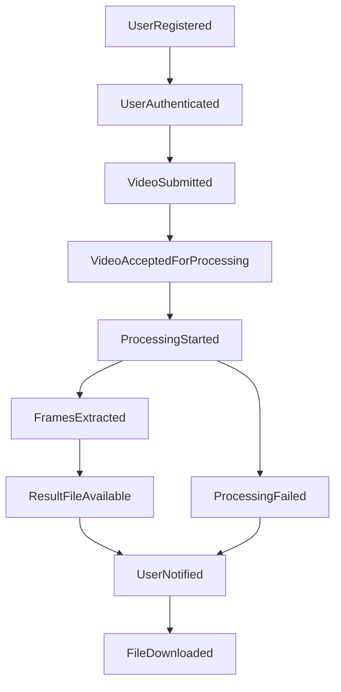

# Domain Modeling — FIAP X (Video Processing System)

> This document records the business/domain modeling discussed before any technical stack decision, for the POSTECH/SOAT Hackathon - Phase 5. The goal is to understand the real business problem before designing the technical solution.
>
> Sections 3, 4, and 5 below are summaries. Detailed versions were split into dedicated documents:
> - `docs/event-storming.md` — full timeline of actors/commands/events/policies/hotspots.
> - `docs/bounded-contexts.md` — each context detailed (ubiquitous language, published/consumed events, anti-scope).
> - `docs/core-domain.md` — full model of the `ProcessingRequest` aggregate (attributes, state machine, invariants, commands).

## 1. What is the business problem, really?

FIAP X sold investors on the promise of a service where **a customer submits a video and gets back the images extracted from it**, reliably, even under heavy concurrent usage, with visibility into what's happening with each request, and being notified when something goes wrong.

The product is **not** "a video-to-zip converter." The product is **a reliable, asynchronous on-demand processing service**. The processing itself (extracting frames) is just the "content"; the real, sellable business value is the **reliability and experience around asynchronicity** (not losing a request, knowing the status, being notified).

Practical implication: engineering effort should be invested less in "how ffmpeg extracts a frame" and more in "how we model the lifecycle of a processing request."

## 2. Actors and needs

- **Customer (end user)**: registers, authenticates, submits a video, tracks the status of their own requests, downloads the result, is notified if something fails.
- **FIAP X (business/operations)**: needs the system to not lose requests under peak load, to scale, and to be auditable/observable.

Per the challenge requirements, there is no "admin" role that views other users' requests, nor organizational multi-tenancy (companies with multiple users). **Point to confirm with the group** before assuming this definitively.

## 3. Event Storming (business flow as domain events)

Modeled as a sequence of business facts that have already happened (Domain Events), not as technical steps:

From these events we derive the **commands** (intents: `SubmitVideo`, `CheckStatus`, `DownloadResult`) and the **states** the system needs to keep.

### Why separate "VideoSubmitted" from "VideoAcceptedForProcessing"

This distinction is the heart of the "don't lose a request under peak load" requirement: **accepting** the upload (making the request durable) must be a separate, cheaper business transaction than **actually processing** it. This decoupling — not the technology behind it — is what solves the resilience-to-peaks requirement.

## 4. Bounded Contexts (subdomains)

Strategic classification (DDD — Eric Evans: core / supporting / generic), which guides where engineering effort is worth investing:

| Context | Strategic role | Ubiquitous language |
|---|---|---|
| **Video Processing** | **Core domain** — this is what FIAP X sells, the differentiator | Processing Request, Video, Frame, Result Package, Status (Pending/Processing/Completed/Failed) |
| **Identity & Access** | **Generic subdomain** — a problem already solved by the industry, not where the business value lies | User, Credential, Session |
| **Notification** | **Supporting subdomain** — necessary, but not the competitive differentiator | Notification, Channel, Source Event |

This classification shows that design effort was invested proportionally to the value of each part: the Identity context can use something off-the-shelf/simple; the Video Processing context is where more care should go into modeling, testing, and resilience.

## 5. Model inside the Core Domain (Video Processing)

**Aggregate root**: `ProcessingRequest` (business name — avoid using only the technical jargon "Job" in domain documentation).

### Invariants protected by the aggregate

- Belongs to exactly one user (owner).
- Valid, one-directional state transitions: `Pending → Processing → (Completed | Failed)`. Never goes backward, never skips a state.
- Can only be downloaded if `Completed`.
- A request has a unique, idempotent identifier — resubmitting the same request (e.g., double click, network retry) must not create two distinct processing runs.

### Value objects

- `VideoMetadata`: original name, size, format.
- `ProcessingResult`: number of frames, reference to the generated package.

## 6. Context map

- **Identity → Video Processing**: a **Conformist** relationship — the Video Processing context doesn't need to know anything about how the user authenticates, it only receives a trusted identifier (token claims). The core domain shouldn't depend on the internal details of the generic subdomain, only on a minimal, stable contract.
- **Video Processing → Notification**: integration via **domain events**, not a direct call. The core context "announces facts" (`ProcessingFailed`) and doesn't know (nor should it know) how that is communicated to the user.

## 7. Business questions — decisions

Business rule gaps in the challenge brief, decided and documented by the group. Each one directly becomes an acceptance criterion and test case.

### 7.1 Visibility scope

**Question**: a user only sees their own requests — is there any "operator/admin" role that sees everything?

**Decision**: no. Each user sees only their own requests. There is no admin/operator role in this version — it wasn't requested by the challenge brief, and adding this scope now would be unrequested work.

### 7.2 Quotas/limits

**Question**: is there a maximum video size, maximum duration, or a limit on concurrent requests per user?

**Decision**:
- **Maximum size per video**: 500 MB.
- **Maximum duration**: 30 minutes. At `fps=1`, this produces up to ~1800 frames per video — a manageable zip, and it comfortably covers longer use cases (e.g., a lecture/talk).
- **Limit on concurrent requests per user**: not implemented in the MVP. The (FIFO) queue already distributes capacity reasonably fairly across users; an explicit per-user concurrency limit is additional complexity not requested by the brief, and is logged as a future improvement.

Both limits (size and duration) are validated on entry, generating the same kind of `VideoRejected` event used for invalid format (see 7.5).

### 7.3 Retention

**Question**: how long is the result (zip) available for download before it expires/is removed? And the original video — do we always discard it (as today), or is there a reprocessing scenario?

**Decision**:
- **Result (zip)**: available for **1 month** after processing completes. Recommended implementation: native lifecycle policy on the S3/MinIO bucket (automatic object expiration), instead of a custom cleanup job.
- **Original video**: remains stored while the request has not reached the `Completed` state, and during the reprocessing window (see 7.4). It is only discarded after success or after exhausting the maximum number of attempts.

### 7.4 Reprocessing on failure

**Question**: if `ProcessingFailed`, can the user request reprocessing of the same request, or do they need to submit the video again?

**Decision**: yes, via a "Retry" button in the UI, without needing a new upload. This is feasible because the original video is retained in object storage until completion (see 7.3). Upon retrying, the request goes back to `Pending` and is re-enqueued.

Limit of **3 attempts** per request, to avoid an infinite retry loop on a genuinely corrupted/invalid video. The `ProcessingRequest` aggregate gains an `attempts` field (counter) as part of its state.

### 7.5 Definition of "error"

**Question**: what counts as a notifiable failure — only a technical error (ffmpeg crashed), or also "unsupported video format," "corrupted video"?

**Decision**: a structured reason (not a boolean, nor free text), with the following codes:

- `INVALID_FORMAT` — extension outside the supported list (see 7.6).
- `SIZE_EXCEEDED` — video larger than 500 MB or longer than 30 minutes.
- `CORRUPTED_FILE` — generic: `ffmpeg` couldn't decode the file. It's not necessary (nor reliable) to differentiate the root cause of the corruption for the user, just to inform that the file couldn't be read.
- `INTERNAL_ERROR` — catch-all for unexpected technical failure (e.g., infrastructure failure).

This structured reason feeds both the message shown in the UI and the notification email template, and directly becomes a test case per category.

### 7.6 Supported video formats

The challenge brief doesn't specify accepted formats — the only reference was the base project's list (`.mp4`, `.avi`, `.mov`, `.mkv`, `.wmv`, `.flv`, `.webm`), which was a decision by the previous team, not a hackathon requirement.

**Decision**: reduce the list to the most commonly used and effectively tested formats: **`.mp4`, `.mov`, `.mkv`, `.webm`**. Legacy formats like `.wmv` and `.flv` were dropped due to low real-world usage and higher risk of incompatibility with `ffmpeg` in a containerized environment, reducing the test surface without losing practical coverage. An upload with an extension outside this list must be rejected during validation (`VideoRejected` event — even before `VideoAcceptedForProcessing`), returning a clear error to the user (`INVALID_FORMAT`) without consuming processing capacity.

### 7.7 Processing parameterization

**Question**: today it's fixed at "1 frame per second" — is this an immutable business rule of the product, or something the customer should be able to choose?

**Decision**: kept fixed at **1 frame per second**. Arguments in favor of parameterizing it (very long videos would generate disproportionately large zips; it could be a future product differentiator) were weighed against the implementation cost (extra validation, an additional field in the UI and the aggregate, more test cases) with no requirement in the brief asking for it — and the 30-minute duration limit (7.2) already mitigates the main problem (excessively large zip) that would motivate parameterization. Logged as a **future improvement outside MVP scope**, a conscious decision, not an oversight.

## 8. Relationship to the technical architecture

The modeling confirms that a microservices architecture split into **Identity / Video Processing / Notification**, communicating via events, reflects the correct bounded contexts — it's not an arbitrary technology choice, it emerges from the business design. This allows each service boundary to be justified in the documentation with business language and explicit invariants, rather than just "we split it because it's best practice."

## Suggested next steps

- [x] Close the business questions in section 7 with the rest of the group.
- [x] Detail step-by-step use cases per actor (including error/exception flows) — see `docs/use-cases.md`.
- [x] Formalize the technical stack decisions in a dedicated document — see `docs/technical-architecture.md`.
- [x] Design the API contract (routes, request/response, status codes) — see `docs/api-contract.md`.
- [ ] Data model / database schema.
- [ ] Backend implementation.
