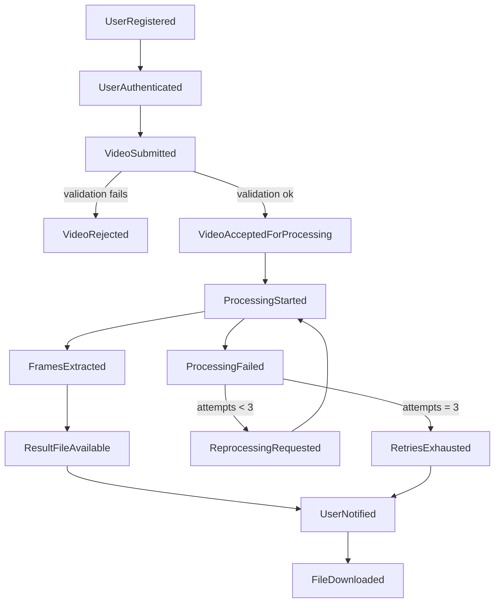

# Event Storming — FIAP X (Video Processing System)

> Detailed breakdown of the business flow using Event Storming notation (Alberto Brandolini): Actors, Commands, Events, Policies, and Read Models. Complements the summary in `docs/domain-modeling.md` (section 3).

## Legend (Event Storming color convention)

| Element | What it represents |
|---|---|
| 🟧 **Domain Event** | A business fact that has already happened, immutable, in the past (`VideoSubmitted`) |
| 🟦 **Command** | An intent/action triggered by an actor (`SubmitVideo`) |
| 🟨 **Actor/Persona** | Who initiates the command (Customer, System/Worker) |
| 🟪 **Policy/Business rule** | "Whenever X happens, Y must be done" — an automatic reaction to an event |
| 🟩 **Read Model** | A read view the user consults (e.g., status list) |
| 🟥 **Hotspot** | A question, risk, or point of attention identified during modeling |

## Full timeline

| # | Actor | Command | Resulting event | Policy triggered | Read Model affected |
|---|---|---|---|---|---|
| 1 | Visitor | `RegisterUser` | 🟧 `UserRegistered` | Hash the password before persisting | — |
| 2 | User | `Authenticate` | 🟧 `UserAuthenticated` | Issue token (claims: user id) | Session |
| 3 | User | `SubmitVideo` | 🟧 `VideoSubmitted` | Validate format/size/duration (see `docs/domain-modeling.md` 7.2, 7.6) | — |
| 3a | System | *(automatic, part of the policy above)* | 🟧 `VideoRejected` (reason: `INVALID_FORMAT` \| `SIZE_EXCEEDED`) | Notify the error immediately in the upload response — does not enter the queue | Requests list |
| 3b | System | *(automatic, part of the policy above)* | 🟧 `VideoAcceptedForProcessing` | Publish a message to the queue with the video reference in storage | Requests list (status `Pending`) |
| 4 | Worker | `StartProcessing` | 🟧 `ProcessingStarted` | — | Requests list (status `Processing`) |
| 5 | Worker | `ExtractFrames` | 🟧 `FramesExtracted` **or** 🟧 `ProcessingFailed` (reason: `CORRUPTED_FILE` \| `INTERNAL_ERROR`) | If failed: decide whether attempts remain (see #9) | Requests list |
| 6 | Worker | `GenerateResultPackage` | 🟧 `ResultFileAvailable` | Apply a 1-month expiration lifecycle policy to the storage object | Requests list (status `Completed`) |
| 7 | System | `NotifyUser` | 🟧 `UserNotified` | Triggered by both `ResultFileAvailable` and `ProcessingFailed` (or `RetriesExhausted`) | — |
| 8 | User | `DownloadResult` | 🟧 `FileDownloaded` | Generate a presigned storage URL, without the app serving the binary | — |
| 9 | User | `RetryProcessing` (if `Failed` and attempts < 3) | 🟧 `ReprocessingRequested` | Increments the `attempts` counter, goes back to step 4 | Requests list (status `Pending` again) |
| 9a | System | *(automatic)* | 🟧 `RetriesExhausted` (if `attempts == 3` and failed again) | Notify the user that reprocessing is no longer possible; the original video may be discarded | Requests list |

## Diagram (simplified event flow)

## Identified hotspots (risks/points of attention)

🟥 **Idempotency of queue messages**: if the broker redelivers the same message (redelivery after a timeout, for example), the worker must not reprocess/duplicate the result. Mitigation: use the request id as an idempotency key before starting `ExtractFrames`.

🟥 **A notification failure must not block the pipeline**: if the email service is unavailable, this cannot prevent the request's state from moving to `Completed`/`Failed`. `UserNotified` should be an asynchronous, decoupled reaction, with its own independent retry policy.

🟥 **Race between "Retry" and expiration/cleanup**: if the original video has already been removed (having reached `RetriesExhausted` or `Completed`), the `RetryProcessing` command should be rejected with a clear message, not fail silently.

🟥 **Event order in notifications**: ensure `UserNotified` always carries the correct reason (success with a link, or failure with the structured error code) — avoid a generic notification without context.
