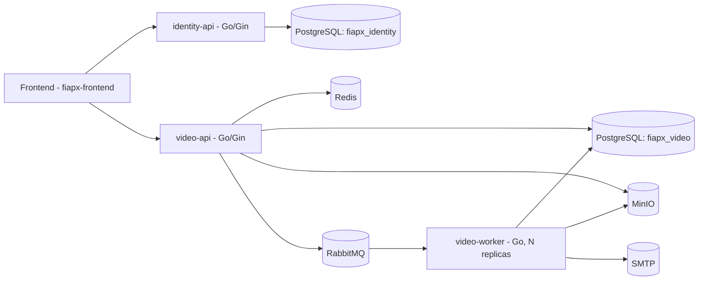

# Technical Architecture — FIAP X (Video Processing System)

> Consolidation of the technical stack decisions, made after closing the domain modeling (`docs/domain-modeling.md`, `docs/event-storming.md`, `docs/bounded-contexts.md`, `docs/core-domain.md`). This document is one of the deliverables required by the challenge brief ("documentation of the proposed architecture").

## 1. Final stack decision

| Layer | Choice |
|---|---|
| Language | **Go** |
| Relational persistence | **PostgreSQL** |
| Cache / fast reads | **Redis** |
| Messaging | **RabbitMQ** |
| File storage | **MinIO** (S3-compatible) |
| Authentication | **Homegrown JWT** (bcrypt for password hashing) |
| Containers | **Docker + Docker Compose** |
| CI/CD | **GitHub Actions** |
| Notification | **SMTP** (Mailtrap in dev / real provider in production) |

This is a conscious decision favoring **simplicity and low execution risk**, not the "most impressive stack possible" — see section 6 (alternatives evaluated and discarded) for the full reasoning.

## 2. Architecture diagram

Interactive runtime version: [`docs/architecture/fiapx-runtime-architecture.html`](architecture/fiapx-runtime-architecture.html).

`video-api` verifies JWTs locally against a secret shared with `identity-api` — no runtime call between the two services (see `docs/adr/0007`).

## 3. Components

Three independently deployable Go binaries, one per bounded context with a runtime footprint (`docs/adr/0007`):

### `identity-api`

Owns the Identity & Access context and its own database (`fiapx_identity`). Responsible for:
- Registration and login (bcrypt password hashing).
- JWT issuance.

Has no protected endpoints of its own — nothing calls back into it to validate a token; see `video-api` below.

### `video-api`

Owns the Video Processing context's synchronous side, its own database (`fiapx_video`), responsible for:
- Verifying JWTs locally against a secret shared with `identity-api` (`internal/platform/jwt.Verify`) — no network call between the two services.
- Video upload (format/size/duration validation, writing to MinIO, creating the `ProcessingRequest` in Postgres, publishing to the queue).
- Status query (lists the authenticated user's requests — reading from Postgres, with Redis as a read cache).
- Download URL generation (presigned URL from MinIO).

### `video-worker` (horizontally scalable)

Same database as `video-api` (`fiapx_video`); independent Go process, RabbitMQ queue consumer:
1. Receives the message with the `ProcessingRequest` reference.
2. Downloads the video from MinIO.
3. Runs `ffmpeg` for frame extraction.
4. Generates the `.zip` and uploads it to MinIO.
5. Updates the status in Postgres.
6. Sends the notification email (success or failure) — using `UserEmail`, a value already carried on the request since upload time, not a lookup into Identity's database.

It's the only component that **needs** to scale horizontally (multiple replicas consuming from the same queue) — that's why it's a deployment separate from `video-api`, orthogonal to the by-bounded-context split.

### PostgreSQL

Two databases, one per service: `fiapx_identity` (users) and `fiapx_video` (processing requests). No foreign key crosses the boundary — `processing_requests.user_id` is an opaque identifier trusted from the JWT claim, not enforced by Postgres.

### Redis

Provisioned in `docker-compose.yml` as a candidate read cache for the status listing endpoint (avoiding repeated Postgres queries from frontend polling) and, optionally, a pub/sub channel for real-time push. **Not yet wired into the code** — no package currently reads from or writes to it. It's not a critical dependency either way: the system works correctly without it, just with more direct load on Postgres. Kept in the compose file as a documented, deliberate placeholder for that future optimization rather than removed, since the stack recommendation explicitly names it.

### RabbitMQ

Work queue between `video-api` and `video-worker`. One message per accepted or reprocessed `ProcessingRequest`. A dead-letter queue is configured for messages that repeatedly fail beyond what the application logic already handles (broker/worker infrastructure failure, not a business failure — business failure is already handled as `ProcessingFailed`, a valid outcome, not a broker exception).

### MinIO

Stores original videos and result packages (`.zip`). Chosen instead of local container disk because:
- It allows multiple `video-worker` replicas without shared-file coordination.
- It supports native lifecycle policies (automatic expiration after 1 month — `docs/domain-modeling.md` 7.3), without needing a custom cleanup cron job.
- It supports presigned URLs, allowing direct download from storage without `video-api` needing to serve the binary.

## 4. How this meets the challenge requirements

| Requirement | How it's met |
|---|---|
| Process more than one video at a time | Multiple `video-worker` replicas consuming the same queue (`docker compose up --scale video-worker=N`) |
| Don't lose requests under peak load | `VideoAcceptedForProcessing` is a lightweight transaction (writes to Postgres + publishes to the queue) and returns immediately; RabbitMQ persists the message until it's processed |
| Protected by username and password | JWT (issued by `identity-api`, verified locally by `video-api`) + bcrypt |
| Status listing | Query endpoint reading from Postgres (Redis cache provisioned, not yet wired — see §3) |
| Notification on error | Worker sends an email via SMTP upon reaching `ProcessingFailed`/`RetriesExhausted` |
| Data persistence | PostgreSQL, one database per service (data) + MinIO (files) |
| Scalable architecture | `video-worker` is stateless and horizontally scalable; `video-api` and `identity-api` are also stateless (JWT-based session, not in-memory session) |
| Versioned on GitHub | Single repository, with commit and PR history |
| Tests that ensure quality | Unit (domain rules) + integration (real Postgres/RabbitMQ via Docker in CI) |
| CI/CD | GitHub Actions: lint → tests → Docker image build |
| Microservices development | Three independently deployable services (`identity-api`, `video-api`, `video-worker`), each with its own database — see `docs/adr/0007` |

## 5. Service split, by bounded context

`docs/adr/0007` supersedes the earlier decision (`docs/adr/0001`) to run everything behind two binaries split only by sync/async. Now split by bounded context as well: `identity-api` owns Identity's data and API; `video-api`/`video-worker` own Video Processing's. Notification stays an in-process library inside `video-worker` (`docs/adr/0006`) — it has no runtime footprint of its own, so it isn't a fourth service.

## 6. Alternatives evaluated and discarded

Logged here because they're part of the decision process and are relevant material for the presentation (it shows evaluation maturity, not unawareness of the options).

| Alternative | Why it was discarded |
|---|---|
| **Temporal** (workflow engine) instead of RabbitMQ + a manual worker | Would solve retry/state more elegantly, but has a steep learning curve for the available timeline; the risk of not delivering anything functional outweighs the sophistication gained |
| **Kubernetes + KEDA** for automatic autoscaling | One more piece of infrastructure that could fail on demo recording day; `docker compose --scale` already demonstrates the horizontal scalability concept with much lower risk |
| **Kafka** instead of RabbitMQ | Kafka is optimized for event streaming with replay/multiple independent consumers; our use case is a classic work queue (one message, one consumer, done and discarded) — RabbitMQ is the right tool for the problem |
| **NATS JetStream** instead of RabbitMQ | A lighter, more modern alternative, but with no concrete gain over RabbitMQ for this use case; RabbitMQ has more mature and better-documented DLQ and ack/retry semantics |
| **Keycloak / Auth0 / Cognito** instead of a homegrown JWT | Identity is a generic subdomain (see `docs/bounded-contexts.md`) — JWT + bcrypt built by hand is little code, has no external dependency, and demonstrates mastery of the security concepts taught in the course |
| **Polyglot services** (services in different languages) | A single stack (Go) reduces CI surface, base images, and operational context — with no real quality gain for the size of this project |

## 7. Resilience and consistency

- **Idempotency**: the `ProcessingRequest` id is the idempotency key when processing queue messages — redelivery of the same message doesn't duplicate the processing.
- **Notification failure doesn't block the pipeline**: sending email is best-effort and decoupled from the request's state transition (hotspot documented in `docs/event-storming.md`).
- **Controlled reprocessing**: at most 3 attempts per request (`docs/domain-modeling.md` 7.4), preventing an infinite retry loop on a genuinely invalid video.
- **Transactional outbox pattern**: logged as a future improvement (stretch goal) — mitigates the window where the Postgres commit succeeds but the queue publish fails (or vice versa). Not implemented in the MVP due to time priority, but consciously documented.

## 8. Security

- Password hashed with `bcrypt`, never plain text.
- JWT with a short expiration, signed with a secret shared between `identity-api` (issues) and `video-api` (verifies) — a cryptographic trust boundary, not a database one (`docs/adr/0007`).
- Download via a MinIO presigned URL, never the binary flowing through `video-api`.
- File type validation shouldn't rely only on the extension — check magic bytes in `video-api` before accepting the upload (abuse mitigation).
- Basic rate limiting on the login endpoint (mitigate brute force).

## 9. Observability

**Implemented**: `GET /health` on both `identity-api` and `video-api` — pings each service's own Postgres pool and returns `503` if unreachable, so it reflects actual readiness rather than just process liveness. Used as the `docker-compose.yml` healthcheck for both services.

**Planned, not yet implemented**: structured (JSON) logs across all three binaries — they currently use the standard `log` package (plain text) and Gin's default text logger, not JSON. `internal/platform/logging` exists as a placeholder package for this but has no code yet.

**Stretch goal, if time allows**: Prometheus metrics (queue depth, processing time, error rate) + a Grafana dashboard versioned in the repository. Not a mandatory requirement of the brief (it's a stack suggestion, not a functional requirement), so it doesn't jeopardize the main delivery if cut.

## 10. Tests and CI/CD

- **Unit**: domain rules (aggregate state transitions, upload validations) — no I/O, fast.
- **Integration**: spinning up real Postgres and RabbitMQ via Docker in the CI pipeline (not just mocks).
- **GitHub Actions**: `go test` → Docker image build → (optional) push to `ghcr.io`.

## 11. Status of this plan

All items originally listed as "next steps" here are done: API contract (`docs/api-contract.md`), data model (`migrations/identity/`, `migrations/video/`), `docker-compose.yml` with all components, and the Go folder structure (`cmd/identity-api`, `cmd/video-api`, `cmd/video-worker`, `internal/...`). Remaining open items are tracked in §9 (structured logs, metrics) and §7 (transactional outbox).
