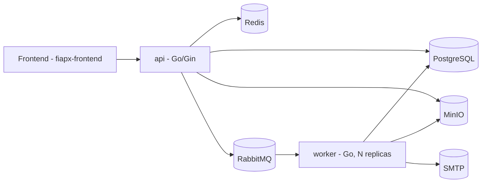

# Technical Architecture — FIAP X (Video Processing System)

> Consolidation of the technical stack decisions, made after closing the domain modeling (`docs/domain-modeling.md`, `docs/event-storming.md`, `docs/bounded-contexts.md`, `docs/core-domain.md`). This document is one of the deliverables required by the challenge brief ("documentation of the proposed architecture").

## 1. Final stack decision

| Layer | Choice |
|---|---|
| Language | **Go** |
| Relational persistence | **PostgreSQL** |
| Cache / fast reads | **Redis** |
| Messaging | **RabbitMQ** |
| File storage | **MinIO** (S3-compatible) |
| Authentication | **Homegrown JWT** (bcrypt for password hashing) |
| Containers | **Docker + Docker Compose** |
| CI/CD | **GitHub Actions** |
| Notification | **SMTP** (Mailtrap in dev / real provider in production) |

This is a conscious decision favoring **simplicity and low execution risk**, not the "most impressive stack possible" — see section 6 (alternatives evaluated and discarded) for the full reasoning.

## 2. Architecture diagram

## 3. Components

### `api` (single service, modular monolith)

A single Go binary/deployment, responsible for:
- Authentication (registration, login, JWT issuance/validation).
- Video upload (format/size/duration validation, writing to MinIO, creating the `ProcessingRequest` in Postgres, publishing to the queue).
- Status query (lists the authenticated user's requests — reading from Postgres, with Redis as a read cache).
- Download URL generation (presigned URL from MinIO).

Internally organized into packages that mirror the bounded contexts from `docs/bounded-contexts.md` (e.g., `internal/identity`, `internal/videoprocessing`, `internal/notification`), even though it's a single process — see section 5.

### `worker` (separate service, horizontally scalable)

Independent Go process, RabbitMQ queue consumer:
1. Receives the message with the `ProcessingRequest` reference.
2. Downloads the video from MinIO.
3. Runs `ffmpeg` for frame extraction.
4. Generates the `.zip` and uploads it to MinIO.
5. Updates the status in Postgres.
6. Publishes the notification email (success or failure).

It's the only component that **needs** to scale horizontally (multiple replicas consuming from the same queue) — that's precisely why it's a deployment separate from `api`, not because every bounded context must necessarily become a microservice.

### PostgreSQL

Source of truth for users and processing requests (see schema in a future data model document).

### Redis

Read cache for the status listing endpoint (avoids repeated Postgres queries from frontend polling) and, optionally, a pub/sub channel for real-time push. It's not a critical dependency — the system works correctly without it (just with more direct load on Postgres).

### RabbitMQ

Work queue between `api` and `worker`. One message per accepted or reprocessed `ProcessingRequest`. A dead-letter queue is configured for messages that repeatedly fail beyond what the application logic already handles (broker/worker infrastructure failure, not a business failure — business failure is already handled as `ProcessingFailed`, a valid outcome, not a broker exception).

### MinIO

Stores original videos and result packages (`.zip`). Chosen instead of local container disk because:
- It allows multiple `worker` replicas without shared-file coordination.
- It supports native lifecycle policies (automatic expiration after 1 month — `docs/domain-modeling.md` 7.3), without needing a custom cleanup cron job.
- It supports presigned URLs, allowing direct download from storage without `api` needing to serve the binary.

## 4. How this meets the challenge requirements

| Requirement | How it's met |
|---|---|
| Process more than one video at a time | Multiple `worker` replicas consuming the same queue (`docker compose up --scale worker=N`) |
| Don't lose requests under peak load | `VideoAcceptedForProcessing` is a lightweight transaction (writes to Postgres + publishes to the queue) and returns immediately; RabbitMQ persists the message until it's processed |
| Protected by username and password | JWT + bcrypt in the Identity & Access context |
| Status listing | Query endpoint reading from Postgres/Redis |
| Notification on error | Worker publishes an email via SMTP upon reaching `ProcessingFailed`/`RetriesExhausted` |
| Data persistence | PostgreSQL (data) + MinIO (files) |
| Scalable architecture | `worker` is stateless and horizontally scalable; `api` is also stateless (JWT-based session, not in-memory session) |
| Versioned on GitHub | Single repository, with commit and PR history |
| Tests that ensure quality | Unit (domain rules) + integration (real Postgres/RabbitMQ via Docker in CI) |
| CI/CD | GitHub Actions: lint → tests → Docker image build |

## 5. Modular monolith vs. "full" microservices

We chose **two binaries** (`api` + `worker`) instead of one microservice per bounded context (Identity, Video Processing, Notification, each with its own deploy/API/database). This is an explicit architectural decision, not a simplification born of ignorance:

- The bounded contexts still exist as **code boundaries** (well-defined internal packages, with their own rules and no responsibility leakage between them — see `docs/bounded-contexts.md`), laying the groundwork for a future extraction into real microservices, if and when the business justifies it.
- The only component that genuinely needs an independent deploy cycle and scaling is the `worker` (it's the one that processes video, it's the one that can have load spikes disproportionate to the `api`) — that's why it's already born as a separate deployment.
- Extracting Identity and Notification as full network services now would add latency, more failure points, and more configuration surface (service discovery, more internal API contracts) with no measurable gain given the team's size and the hackathon's timeline.

## 6. Alternatives evaluated and discarded

Logged here because they're part of the decision process and are relevant material for the presentation (it shows evaluation maturity, not unawareness of the options).

| Alternative | Why it was discarded |
|---|---|
| **Temporal** (workflow engine) instead of RabbitMQ + a manual worker | Would solve retry/state more elegantly, but has a steep learning curve for the available timeline; the risk of not delivering anything functional outweighs the sophistication gained |
| **Kubernetes + KEDA** for automatic autoscaling | One more piece of infrastructure that could fail on demo recording day; `docker compose --scale` already demonstrates the horizontal scalability concept with much lower risk |
| **Kafka** instead of RabbitMQ | Kafka is optimized for event streaming with replay/multiple independent consumers; our use case is a classic work queue (one message, one consumer, done and discarded) — RabbitMQ is the right tool for the problem |
| **NATS JetStream** instead of RabbitMQ | A lighter, more modern alternative, but with no concrete gain over RabbitMQ for this use case; RabbitMQ has more mature and better-documented DLQ and ack/retry semantics |
| **Keycloak / Auth0 / Cognito** instead of a homegrown JWT | Identity is a generic subdomain (see `docs/bounded-contexts.md`) — JWT + bcrypt built by hand is little code, has no external dependency, and demonstrates mastery of the security concepts taught in the course |
| **Polyglot services** (services in different languages) | A single stack (Go) reduces CI surface, base images, and operational context — with no real quality gain for the size of this project |
| **One microservice per bounded context** | See section 5 |

## 7. Resilience and consistency

- **Idempotency**: the `ProcessingRequest` id is the idempotency key when processing queue messages — redelivery of the same message doesn't duplicate the processing.
- **Notification failure doesn't block the pipeline**: sending email is best-effort and decoupled from the request's state transition (hotspot documented in `docs/event-storming.md`).
- **Controlled reprocessing**: at most 3 attempts per request (`docs/domain-modeling.md` 7.4), preventing an infinite retry loop on a genuinely invalid video.
- **Transactional outbox pattern**: logged as a future improvement (stretch goal) — mitigates the window where the Postgres commit succeeds but the queue publish fails (or vice versa). Not implemented in the MVP due to time priority, but consciously documented.

## 8. Security

- Password hashed with `bcrypt`, never plain text.
- JWT with a short expiration.
- Download via a MinIO presigned URL, never the binary flowing through `api`.
- File type validation shouldn't rely only on the extension — check magic bytes in `api` before accepting the upload (abuse mitigation).
- Basic rate limiting on the login endpoint (mitigate brute force).

## 9. Observability

**Essential for the MVP**: structured (JSON) logs in `api` and `worker`.

**Stretch goal, if time allows**: Prometheus metrics (queue depth, processing time, error rate) + a Grafana dashboard versioned in the repository. Not a mandatory requirement of the brief (it's a stack suggestion, not a functional requirement), so it doesn't jeopardize the main delivery if cut.

## 10. Tests and CI/CD

- **Unit**: domain rules (aggregate state transitions, upload validations) — no I/O, fast.
- **Integration**: spinning up real Postgres and RabbitMQ via Docker in the CI pipeline (not just mocks).
- **GitHub Actions**: `go test` → Docker image build → (optional) push to `ghcr.io`.

## 11. Next steps

- [ ] API contract (routes, request/response, status codes).
- [ ] Data model / PostgreSQL schema.
- [ ] `docker-compose.yml` with all components.
- [ ] Go repository folder structure (`cmd/api`, `cmd/worker`, `internal/...`).
